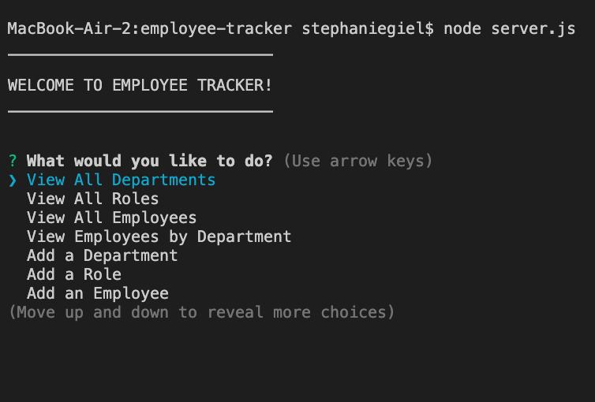

# Employee Tracker 

## Description
  This command-line application allows a buisness owner to view and manage the department, role, and employee data in a company. 
  
  This application allows the manager to view, create, update and delete departments, roles and employees in the company. Note that only employees with tiles that include Lead in their title are allowed to be made managers of another employee. Also note, that managers do not have to have managers.
  
  This project utilizes Node.js, the MySQL2 package, the Inquirer package, and the console.table package.

## Installation
  Clone the repository to your terminal. Intall Node.js to your terminal. Install MySQL2, Inquirer and console.table packages to the root of your project directory. When you star the application go into mysql and type source schema.sql and source seeds.sql for initial creation of the database and tables and to provide seed the application with mock data. To run the application, type node server.js from the root of your directory.

## Screenshots of terminal application 

## Usage
  [Link to Employee Tracker application walk-through video](https://drive.google.com/file/d/1pU4vjhVSz6vKKv4JV9lb5QJKZwZ5xIQC/view) 

## License  
  
Licensed under the The MIT License (the "License");
you may not use this file except in compliance with the License.
You may obtain a copy of the License at

(https://opensource.org/licenses/MIT)

Unless required by applicable law or agreed to in writing, software
distributed under the License is distributed on an "AS IS" BASIS,
WITHOUT WARRANTIES OR CONDITIONS OF ANY KIND, either express or implied.
See the License for the specific language governing permissions and
limitations under the License.
  

    